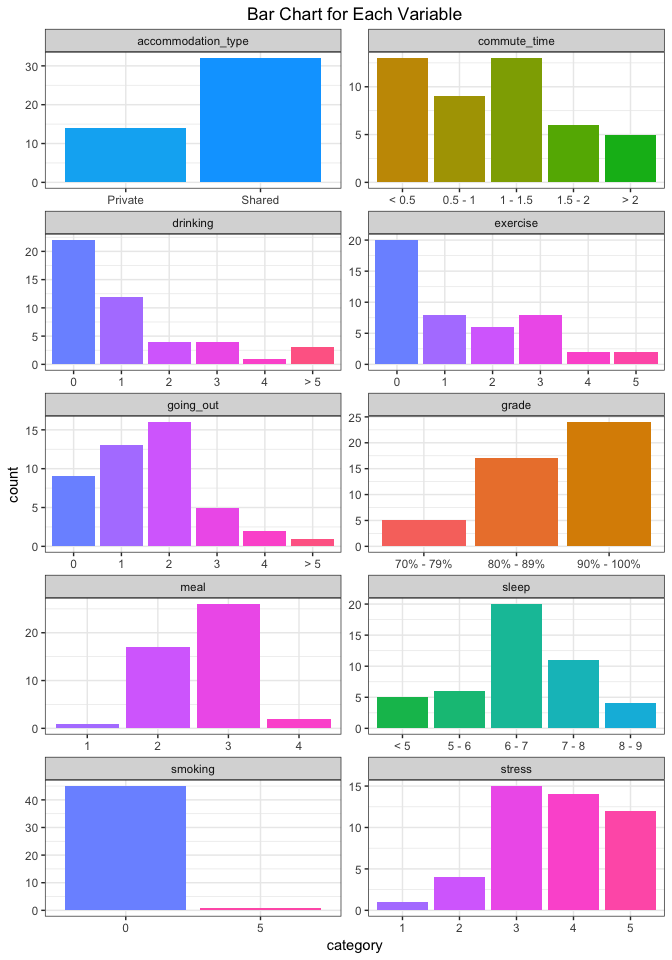
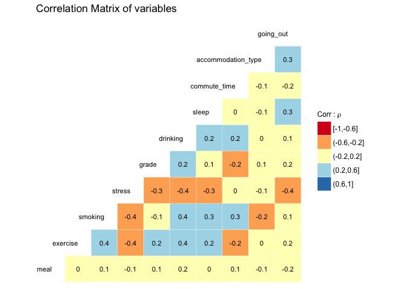
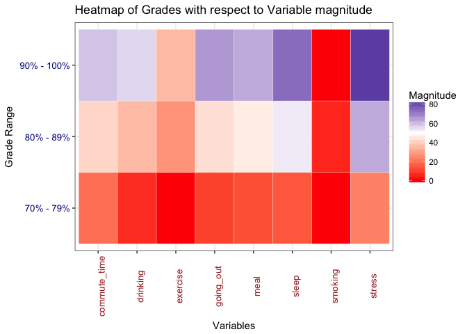
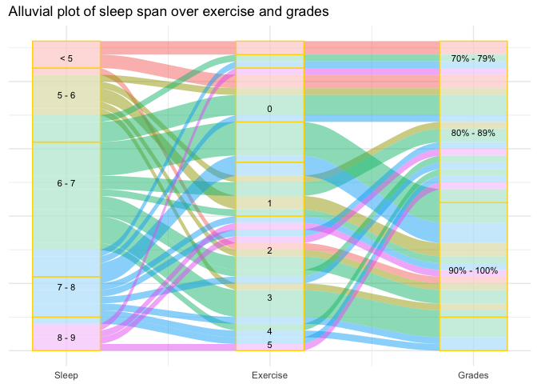

Milestone 1 Report
================

Survey
------

This survey was created using [Google Forms](https://www.google.ca/forms/about/) and can be found [here](https://goo.gl/forms/RnSzp6LJHi78rYhF2).

The survey contains the following questions:

``` r
data <- read_csv("../Data/Response_data.csv")
# drop Timestamp:
data["Timestamp"] <- NULL
Questions <- data %>% colnames() 
questions <- as.data.frame(Questions)
questions%>% kable()
```

<table>
<colgroup>
<col width="100%" />
</colgroup>
<thead>
<tr class="header">
<th align="left">Questions</th>
</tr>
</thead>
<tbody>
<tr class="odd">
<td align="left">What is your average grade (%)?</td>
</tr>
<tr class="even">
<td align="left">How many hours do you sleep per day?</td>
</tr>
<tr class="odd">
<td align="left">How many hours do you spend on commute per day?</td>
</tr>
<tr class="even">
<td align="left">Do you live in a private or shared accommodation (with families/roommates)?</td>
</tr>
<tr class="odd">
<td align="left">How many meals do you have per day?</td>
</tr>
<tr class="even">
<td align="left">How many times do you go out (with friends/families) per week?</td>
</tr>
<tr class="odd">
<td align="left">How many times do you do exercise per week?</td>
</tr>
<tr class="even">
<td align="left">How many cigarettes do you smoke per day?</td>
</tr>
<tr class="odd">
<td align="left">How many standard alcoholic drinks do you have per week?</td>
</tr>
<tr class="even">
<td align="left">How stressed do you feel out of a scale of 5?</td>
</tr>
</tbody>
</table>

The raw data collected from the survey can be found [here](https://github.ubc.ca/alexguox/SleepMatters/blob/master/Data/Response_data.csv).

Data Wrangling and EDA
----------------------

First of all, we will process our data by changing column names to make it handier.

``` r
row_data <- read_csv("../Data/Response_data.csv")

# drop Timestamp:
row_data["Timestamp"] <- NULL

colnames(row_data) = c("grade","sleep","commute_time","accommodation_type",
                   "meal","going_out","exercise","smoking", "drinking", "stress")
write_csv(row_data,path = "../Data/processed_data.csv")
```

### Summary Tables

We created a summary function to display the question, frequency, and percentage of each category.

``` r
data <- read_csv("../Data/processed_data.csv")

columns <-  c("grade","sleep", "commute_time","accommodation_type","meal","going_out","exercise","smoking", "drinking", "stress")

data[columns] <- lapply(data[columns], factor)


# we can get column indices this way, if we want to
# change function input from column index to column name, 
# grep("grade", colnames(data))

print_summary <- function(data, i, form =c("html","rst","latex","markdown", "pandoc")){
  #
  # inputs: 
  #  data: dataframe
  #  i : column index 
  #  form = format of output table   
  #  prints summary table for a categorical variable 
  
  columns <- colnames(data)
  survey_len <-  length(data[[i]])
  summ <- data %>%  group_by(.[[i]]) %>% 
    summarize(frequency = n(), 
              percentage = paste(round(n()/survey_len*100), 
                                 "%") )
  colnames(summ)[1] = columns[i]
  return(knitr::kable(summ,
                     align = 'c',
                     format = form))
}


#for(i in 1:ncol(data)){
#  print_summary(data,i, "rst")
#}
```

``` r
print_summary(data,1, "markdown")
```

|    grade   | frequency | percentage |
|:----------:|:---------:|:----------:|
|  70% - 79% |     5     |    11 %    |
|  80% - 89% |     17    |    37 %    |
| 90% - 100% |     24    |    52 %    |

``` r
print_summary(data,2, "markdown")
```

|  sleep | frequency | percentage |
|:------:|:---------:|:----------:|
| &lt; 5 |     5     |    11 %    |
|  5 - 6 |     6     |    13 %    |
|  6 - 7 |     20    |    43 %    |
|  7 - 8 |     11    |    24 %    |
|  8 - 9 |     4     |     9 %    |

``` r
print_summary(data,3, "markdown")
```

| commute\_time | frequency | percentage |
|:-------------:|:---------:|:----------:|
|    &lt; 0.5   |     13    |    28 %    |
|     &gt; 2    |     5     |    11 %    |
|    0.5 - 1    |     9     |    20 %    |
|    1 - 1.5    |     13    |    28 %    |
|    1.5 - 2    |     6     |    13 %    |

-   As we can see from the table, `accomodation_type` variable was a good distribution of our data.

``` r
print_summary(data,4, "markdown")
```

| accommodation\_type | frequency | percentage |
|:-------------------:|:---------:|:----------:|
|       Private       |     14    |    30 %    |
|        Shared       |     32    |    70 %    |

-   We have 4 categories for `meal`, and 1 meal per day has only 1 person. Therefore, we can regard this as an outlier for this variable.

``` r
print_summary(data,5, "markdown")
```

| meal | frequency | percentage |
|:----:|:---------:|:----------:|
|   1  |     1     |     2 %    |
|   2  |     17    |    37 %    |
|   3  |     26    |    57 %    |
|   4  |     2     |     4 %    |

-   We have 6 categories for `going_out`, and `>5` has only 1 person. Therefore, we can regard this as an outlier for this variable.

``` r
print_summary(data,6, "markdown")
```

| going\_out | frequency | percentage |
|:----------:|:---------:|:----------:|
|   &gt; 5   |     1     |     2 %    |
|      0     |     9     |    20 %    |
|      1     |     13    |    28 %    |
|      2     |     16    |    35 %    |
|      3     |     5     |    11 %    |
|      4     |     2     |     4 %    |

-   We have 6 categories for `exercise`, and 4 and 5 times per week answers have only 2 people. Therefore, we may need to combine these categories going forward, or another option is we can regard them as outliers.

``` r
print_summary(data,7, "markdown")
```

| exercise | frequency | percentage |
|:--------:|:---------:|:----------:|
|     0    |     20    |    43 %    |
|     1    |     8     |    17 %    |
|     2    |     6     |    13 %    |
|     3    |     8     |    17 %    |
|     4    |     2     |     4 %    |
|     5    |     2     |     4 %    |

-   We can see from the table below, only 1 person is smoking in the survey. Therefore, we will not include this variable in our analysis going forward.

``` r
print_summary(data,8, "markdown")
```

| smoking | frequency | percentage |
|:-------:|:---------:|:----------:|
|    0    |     45    |    98 %    |
|    5    |     1     |     2 %    |

-   We have 6 categories for `drinking`, and some answers have few people. Therefore, we may need to combine some of the categories going forward.

``` r
print_summary(data,9, "markdown")
```

| drinking | frequency | percentage |
|:--------:|:---------:|:----------:|
|  &gt; 5  |     3     |     7 %    |
|     0    |     22    |    48 %    |
|     1    |     12    |    26 %    |
|     2    |     4     |     9 %    |
|     3    |     4     |     9 %    |
|     4    |     1     |     2 %    |

-   We have 5 categories for `stress`, and `1` stress level has only 1 person. Therefore, we can regard this as an outlier for this variable.

``` r
print_summary(data,10, "markdown")
```

| stress | frequency | percentage |
|:------:|:---------:|:----------:|
|    1   |     1     |     2 %    |
|    2   |     4     |     9 %    |
|    3   |     15    |    33 %    |
|    4   |     14    |    30 %    |
|    5   |     12    |    26 %    |

### Bar Charts

We visualized our conclusion in the summary tables above as bar charts below.

``` r
data_bar <- data %>% gather()
  
data_bar$value <- factor(data_bar$value, levels = c("70% - 79%","80% - 89%","90% - 100%",
                                                    "< 0.5","0.5 - 1","1 - 1.5","1.5 - 2","> 2",
                                                    "< 5","5 - 6","6 - 7","7 - 8","8 - 9",
                                                    "Private","Shared",
                                                    "0","1","2","3","4","5","> 5"))

data_bar %>%   
  ggplot(aes(x=value)) +
    facet_wrap(~ key, scales = "free", ncol = 2, nrow = 5) +
    geom_bar(aes(fill=value)) +
    labs(x="category", title="Bar Chart for Each Variable") +
    scale_fill_discrete(guide=FALSE) +
    theme_bw() +
    theme(plot.title = element_text(hjust = 0.5))
```



From the bar charts above, we can confirm our observation that most of the variables are well distributed, except for

-   `meal` has 1 outlier in category "1"
-   `going_out` has 1 outlier in category "&gt; 5"
-   `stress` has 1 outlier in category "1"
-   Only 1 person is smoking, so `smoking` will not be included in our analysis going forward.

### Correlation Matrix

We used Correlation Matrix to find the correlation between variables, and pick the most influential variables (highly positive or negative correlation) for further analysis.

``` r
## Convert ordered factors to numeric values
data$grade2 <- as.numeric(data$grade)
data$going_out2 <- as.numeric(data$going_out)
data$drinking2 <- as.numeric(data$drinking)
data$sleep2 <- as.numeric(data$sleep)
data$commute_time2 <- as.numeric(data$commute_time)
data$accommodation_type2 <- as.numeric(data$accommodation_type)

## Select only numeric variables
df <- data %>%
  select(-grade,-going_out,-drinking,-sleep,-commute_time,
         -accommodation_type)
df <- df %>%
  mutate(grade = grade2,drinking = drinking2,
         sleep = sleep2,commute_time = commute_time2,
         accommodation_type = accommodation_type2,going_out= going_out2) %>% 
  select(-grade2,-going_out2,-drinking2,-sleep2,
         -commute_time2,-accommodation_type2)

## plot correlation matrix

ggcorr(df, nbreaks = 5, palette = "RdYlBu", label = TRUE,
       label_size = 3, max_size = 6, size = 3, hjust = 1,
       name = TeX("Corr : $\\rho$")) +
  ggplot2::labs(title = "Correlation Matrix of variables") 
```




-   The categorical variables have been converted into numeric levels to under the correlation as corr plot only accepts, numeric clsses.

-   We see our main variables, grade and sleep, have a weak positive correlation.

-   Exercise has a positive correlation with most of the positive variables and it has the strongest negative correlation with stress.

-   Stress and grades have a negative correlation with -0.3.

-   Accommodation type and meal are the variables which have the least correlation to the other variables.

-   Although we have smoking variable here, we can disregard this row as we do not have a significant number of smoker in our survey.

### Heatmap

We used Heatmap to show the distribution of explanatory and confounding variables' magnitude across grade categories.

``` r
## Gather data of numeric variables with respect to grades 

gathered <- data %>% select(-grade2,-going_out,-drinking,-sleep,-commute_time) %>% 
  mutate(drinking = drinking2,sleep = sleep2,commute_time = commute_time2,going_out= going_out2) %>%    
  select(-going_out2,-drinking2,-sleep2,-commute_time2,-accommodation_type2) %>% 
  gather(key = "variables", value = "value", meal:going_out) 


heatmap_df <-gathered %>%
  group_by(grade,variables) %>%
  summarise(magnitude = sum(value))
```

``` r
## Plot a Heatmap of how the magnitude of a variable falls in a grade category

ggplot(heatmap_df, aes(variables, grade)) +
  geom_tile(aes(fill = magnitude),
   colour = "white")  + 
  scale_fill_gradient2(low = "red", high = "darkblue", midpoint = 50,
                       mid = "white", space = "rgb",na.value = "grey50", guide = "colourbar") + 
  theme_bw() + 
  labs(title = "Heatmap of Grades with respect to Variable magnitude", 
       y ="Grade Range",  x = "Variables", fill = "Magnitude") + 
  theme(axis.text.x = element_text(color="brown", size=10, angle=90),
        axis.text.y = element_text( color="darkblue", size=10))
```



-  For creating this heatmap the categorical varaibles were transformed into ordinal values and the magnitude scale is according to the lower and higher levels in each variable scaled from 0-80
- The color of the heatmap captures the frequency of resposes within a range of ordinal variable
- Also note `accommodation type` has been excluded from the heatmap as it had `private` and `shared` categories which are difficult to transform to ordinal values
- From the plot it seems like stress and sleep are the variables which have a negative effect on grades. Smoking is not so useful as it has minimal effect across grade categories because of unbalanced data for smoking.

### Alluvial Plot

We used Alluvial Plot to examine the "sleep -&gt; exercise -&gt; grades" pattern.

``` r
alv_df <- data %>% select(grade,sleep,exercise)

alv_df<- alv_df %>% group_by(sleep,exercise,grade) %>% summarise(n = n())

ggplot(alv_df,
       aes(weight = n,
           axis1 = sleep, axis2 = exercise, axis3 = grade)) +
  geom_alluvium(aes(fill = sleep),reverse = TRUE) +
  guides(fill = FALSE) +
  geom_stratum( reverse = FALSE, color = "gold", alpha = 0.5) +
  geom_text(stat = "stratum", label.strata = TRUE, size = 3) +
  scale_x_continuous(breaks = 1:3, 
                     labels = c("Sleep", "Exercise", "Grades")) + 
  theme_minimal() + 
  theme(axis.text.y=element_blank()) +
  ggtitle("Alluvial plot of sleep span over exercise and grades")
```



-   We can see that sleep time and exercise does not give us a clear direct picture. However, if we follow the `sleep -> exercise-> grades` patterns then we can sense that exercise has a positive effect on both sleep and grades which we already saw in our correlation plot. `exercise` has a positive correlation between both `sleep` and `grades`.

- Exercise seems like a good variable for further examination in this relationship.
- The alluvial plots could have been used to understand other confounding variables as well like stress, commute time. We will study this extensively for the next milestone.
