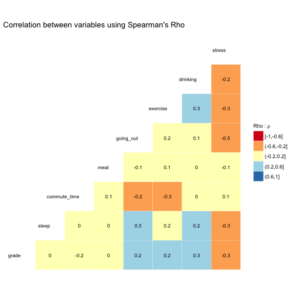

## Introduction

Our question is **"How does sleep duration affect student's MDS performance (grade)?"**. We believe sleeping has a significant effect on students' grades. We have always been told sleep is a foundation of well being and physical health. It was the light bulb moment for this survey. We have felt our sleeping patterns have been affecting our performance, and, out of curiosity, we wanted to see if our belief has a solid ground, or are there other confounding factors affecting student's grades. Therefore, we would like to test our hypothesis by conducting a survey in which we will ask several questions to find out the validity of our belief. 

### Survey Questions

This survey was created using [Google Forms](https://www.google.ca/forms/about/) and can be found [here](https://goo.gl/forms/RnSzp6LJHi78rYhF2).

The raw data collected from the survey can be found [here](https://github.ubc.ca/alexguox/SleepMatters/blob/master/Data/raw_data.csv).

The survey contains the following questions:


```r
# Output Survey Questions: 
questions%>% kable()
```


|Questions                                                                   |
|:---------------------------------------------------------------------------|
|What is your average grade (%)?                                             |
|How many hours do you sleep per day?                                        |
|How many hours do you spend on commute per day?                             |
|Do you live in a private or shared accommodation (with families/roommates)? |
|How many meals do you have per day?                                         |
|How many times do you go out (with friends/families) per week?              |
|How many times do you do exercise per week?                                 |
|How many cigarettes do you smoke per day?                                   |
|How many standard alcoholic drinks do you have per week?                    |
|How stressed do you feel out of a scale of 5?                               |

#### How did we select these questions?

The following categories are the key factors we have came up with to set up survey questions to identify the confounding variables, following are the questions and the reason for their selection:

Also note when we say students' performance, we talk about grades in specific as performance can have a lot of other measures.

- **eating habits**
    -  *How many meals do you have per day on average?*
        - We want to learn about the eating habits of the students since we believe eating habits may also have an effect on students' performance. For instance, inadequate number of meals, fast food and heavy oily food can affect their performance badly.
- **going out**
    -  *How many times do you go out per week?*
        - We believe going out or having a social life could give us some idea about students performance and social well-being.  
- **exercise**
    - *How many times do you exercise per week?*
        - Like eating habits, exercise is also important for health. Therefore, we want to see if exercise has any effect on student' grades.
- **smoking**
    - *Do you smoke (if yes, how often)?*
        - Smoke would be confounding variable affecting students' performance by affecting her/his health.
- **drinking**
    - *Do you drink alcohol (if yes, how often)?*
        - Drinking alcohol would be a pair for going out. For example, a student both goes out often and drinks alcohol a lot would have multiplicative negative effects on the performance.
- **accommodation type (private or shared)**
    -  *Do you live in shared accommodation or private (alone or with family)?*
        - Living space could both sleeping routine and performance of a student. For example, if someone lives at a disturbing shared flat. It would definitely affect student's sleeping pattern and performance.
- **commute time**
    -  *What is your daily average commute time?*
        -  It would be exhausting to commute from a far place and may affect student's sleeping pattern and performance. The student may not have enough time to sleep.
- **stress level**
    - *How stressed do you feel out of 10 scale?*
        - Stress level would have a negative effect on student performance while it would increase (or decrease) her/his sleep time, stress can come from all sorts of sources.  

## Data Wrangling and EDA


First of all, we will download raw data from Google-Docs which is created through the survey responses. Through `Google-Docs` we will be able to automate the access to the survey results and after this, we will process our data by changing column names(which were originally questions) to short variable names in order to make the dataset handier.

The data processing is done using [SaveSurvey.R](https://github.ubc.ca/ubc-mds-2017/SleepMatters/blob/master/Scripts/SaveSurvey.R) script to get the final output as [processed_data.csv](https://github.ubc.ca/ubc-mds-2017/SleepMatters/blob/master/Results/processed_data.csv)


### Bar Charts

Bar charts are the simplest way to visualize summary counts for categorical(or ordinal) variables. We used the bar plots to visually represent the summary counts for each variable and not going back and forth with the summary tables to understand the variable distributions.


```r
# show bar_plot: 
bar_plot
```


### Summary Tables

We created a summary function to display the question, frequency, and percentage of each category. Below, you can see the variables, we believe it is worth summarizing and comment on the raw values of variables. 

Also, in the initial EDA, we found out some variables have too many categories which can be combined to make the analysis more tangible and adjust for the lack of data in some categories.


- We have 4 categories for `meal`, and 1-meal-per-day has only 1 person, also 4 meals-per-day has 2 people. Therefore, we can see most of the people who participated in the survey eat 2 or 3 meals per day. These categories can act as `direct identifiers` due to lack of samples for extreme values.


```r
# meal:
print_summary(data,5, "markdown")
```


| meal | frequency | percentage |
|:----:|:---------:|:----------:|
|  1   |     1     |    2 %     |
|  2   |    17     |    37 %    |
|  3   |    26     |    57 %    |
|  4   |     2     |    4 %     |

- We have 6 categories for `going_out`, and `> 5` has only 1 person. Therefore, we can see we do not have enough sample for this category, and we may consider to combine it with other categories.


```r
#going_out:
print_summary(data,6, "markdown")
```


| going_out | frequency | percentage |
|:---------:|:---------:|:----------:|
|    > 5    |     1     |    2 %     |
|     0     |     9     |    20 %    |
|     1     |    13     |    28 %    |
|     2     |    16     |    35 %    |
|     3     |     5     |    11 %    |
|     4     |     2     |    4 %     |


- We have 6 categories for `exercise`, and 4 and 5 times per week answers have only 2 people. Therefore, we may need to combine these categories going forward, or another option is we can regard them as outliers.


```r
#exercise:
print_summary(data,7, "markdown")
```


| exercise | frequency | percentage |
|:--------:|:---------:|:----------:|
|    0     |    20     |    43 %    |
|    1     |     8     |    17 %    |
|    2     |     6     |    13 %    |
|    3     |     8     |    17 %    |
|    4     |     2     |    4 %     |
|    5     |     2     |    4 %     |


- We can see from the table below, only 1 person smokes among the survey responders. Therefore, we will not include this variable in our analysis going forward. It will not have explanatory power due to lack of sample for smoking category.


```r
#smoking: 
print_summary(data,8, "markdown")
```


| smoking | frequency | percentage |
|:-------:|:---------:|:----------:|
|    0    |    45     |    98 %    |
|    5    |     1     |    2 %     |

- We have 6 categories for `drinking`, and some answers have few people. Therefore, we may need to combine some of the categories going forward.


```r
#drinking: 
print_summary(data,9, "markdown")
```


| drinking | frequency | percentage |
|:--------:|:---------:|:----------:|
|   > 5    |     3     |    7 %     |
|    0     |    22     |    48 %    |
|    1     |    12     |    26 %    |
|    2     |     4     |    9 %     |
|    3     |     4     |    9 %     |
|    4     |     1     |    2 %     |

 - We have 5 categories for `stress`, and `1` stress level has only 1 person. Therefore, we can regard this as an outlier for this variable but as we do not have a large sample it may be due to total sample size so one solution may be combining this category with the closest category.


```r
#stress:
print_summary(data,10, "markdown")
```


| stress | frequency | percentage |
|:------:|:---------:|:----------:|
|   1    |     1     |    2 %     |
|   2    |     4     |    9 %     |
|   3    |    15     |    33 %    |
|   4    |    14     |    30 %    |
|   5    |    12     |    26 %    |


From the summary tables and bar charts, we can see that most of the variables have fairly reasonable distributions, except for the following:

- Only 1 person is smoking, so `smoking` will not be included in our analysis going forward since it will not add any explanatory power to our analysis. Also, it will be a **direct identifier** for the single smoker in the group, and we will not use this variable for this reason.


### Combining Variables

From the summary tables and bar charts, we know that for `going_out`, there is only one data points in level "> 5", which is not informative. So we decided to combine the level "4" and "> 5" into one level as "> 3". Similarly for `drinking`, there is only one data points in level "4", so level "4" and "> 5" were combined into one level as "> 3" as well.


```r
# combine the levels "4" and "> 5" in going_out and drinking into one level "> 3"
data$going_out[data$going_out %in% c("4","> 5")] <- "> 3"
data$drinking[data$drinking %in% c("4","> 5")] <- "> 3"
```

Our response variable `sleep` has three levels, "70% - 79%","80% - 89%", and "90% - 100%", which are in an increasing order, so it is an ordinal variable and needs to be assigned `order` or rank. All other variables are categorical and were set as `factor` in R, as below.


```r
# set grade as an ordinal variable
data$grade <- ordered(data$grade, levels=c("70% - 79%","80% - 89%", "90% - 100%"))

# set all other variabls as factors
data$sleep <- factor(data$sleep, levels=c("< 5","5 - 6","6 - 7","7 - 8","8 - 9"))
data$commute_time <- factor(data$commute_time, levels=c("< 0.5","0.5 - 1","1 - 1.5","1.5 - 2","> 2"))
data$drinking <- factor(data$drinking, levels=c("0","1","2","3","> 3"))
data$going_out <- factor(data$going_out, levels=c("0","1","2","3","> 3"))
data$accommodation_type <- factor(data$accommodation_type, levels=c("Private", "Shared"))
```


### Correlation Matrix - Test of Association between Variables

* For categorical variables, the concept of correlation can be understood in terms of significance test and effect size (strength of association).
* The measure of association indicates the strength of the relationship, whether, weak or strong but it does not indicate causality.

> __Spearman's Rho__

* Spearman's Rho produces a rank order correlation coefficient that is similar to the correlation coefficient produced by the Pearson's Correlation Coefficient test. This test evaluates the degree to which individuals or cases with high rankings on one variable were observed to have similar rankings on another variable

  - Implementation technique : 
  
    * The first step in the process of calculating Spearman's Rho will involve assigning ranks. For this analysis, we have converted the categorical values to numeric based on the "levels" in each category, so < 5 hours gets rank 1, 5-6 hours gets rank 2 etc.
    * The result of this process is a `rank order correlation` coefficient between two variables, which provides an initial indication of the existence of a relatively strong positive or negative correlation between the two variables.


We used Correlation Matrix to find the correlation between variables, and pick the most influential variables (highly positive or negative correlation) for further analysis.

  -  `Assumption` : Only variables which could be converted to ranked or ordinal variables were used in this correlation plot. `Accommodation Type` which is as "Private" and "Shared" cannot be converted into a ranked variable. Also `smoking` will be removed as mentioned in the data summary section.

  -  The above methodology for computed correlation for ordinal variables is taken from this paper: [Statbook](https://www.harding.edu/sbreezeel/460%20files/statbook/chapter14.pdf)

  -  *[ggcorr documentation](https://briatte.github.io/ggcorr/)* for understanding how the correlation plot is created and its function parameters


```r
## plot correlation matrix using spearman rho

ggcorr(data_temp, nbreaks = 5, palette = "RdYlBu", label = TRUE,
       label_size = 3, max_size = 6, size = 3, hjust = 1, method = c("pairwise", "spearman"),
       name = TeX("Rho : $\\rho$")) +
  ggplot2::labs(title = "Correlation between variables using Spearman's Rho ") 
```



> __Correlation Plot Observations__

- Exercise has a weak negative correlation with stress and commute_time with correlation coefficient rho as -0.3.  
- Grades have weak negative correlation with stress with rho as -0.3.
- Another interesting observation we found was stress and going out and exercise are negatively correlated with rho as -0.5.
- Meal has very weak association with most variables.


## Analysis

### Model Selection

Since our response variable `grade` is an ordinal variable, we choose the cumulative link models (CLMs) to fit our data. The `clm` function in the `ordinal` package fits cumulative link models (CLMs) such as the proportional odds model, which is suitable for an ordinal response. We used this function and specified the link function as `logit`. 

### Feature Selection

Backward Elimination is going to be the feature selection method, where all variables are included in the initial model and will be removed later based on their impact on the model. 

### Fitting the Model


#### Assumptions before fitting the model

* There is no interaction between the `X` and the confounders
* There is no interaction between confounders

[source](https://github.ubc.ca/ubc-mds-2017/DSCI_554_exper-causal-inf_students/blob/master/Lec5scrb.pdf)

First, we put all variables in the model.


```r
# Fit Cumulative Link Model on All Explanatory Variables:
model <- clm(grade ~ sleep + commute_time + drinking + exercise + going_out + meal + stress + accommodation_type, 
             data = data,
             link = "logit")
summary(model)
```

```
## formula: 
## grade ~ sleep + commute_time + drinking + exercise + going_out + meal + stress + accommodation_type
## data:    data
## 
##  link  threshold nobs logLik AIC   niter max.grad cond.H 
##  logit flexible  46   -26.50 97.01 6(0)  6.00e-08 8.8e+03
## 
## Coefficients:
##                          Estimate Std. Error z value Pr(>|z|)  
## sleep5 - 6                 0.5607     1.7613   0.318   0.7502  
## sleep6 - 7                 2.6381     1.3673   1.929   0.0537 .
## sleep7 - 8                 2.3501     1.5518   1.514   0.1299  
## sleep8 - 9                -2.0261     2.4836  -0.816   0.4146  
## commute_time0.5 - 1       -1.9866     1.4139  -1.405   0.1600  
## commute_time1 - 1.5        0.5508     1.4745   0.374   0.7087  
## commute_time1.5 - 2       -4.4339     1.8041  -2.458   0.0140 *
## commute_time> 2           -1.2785     1.6487  -0.775   0.4381  
## drinking1                  1.1838     1.1929   0.992   0.3210  
## drinking2                  4.6055     2.0104   2.291   0.0220 *
## drinking3                  0.5917     1.7013   0.348   0.7280  
## drinking> 3                1.7185     1.7841   0.963   0.3354  
## exercise                  -0.1969     0.3360  -0.586   0.5578  
## going_out1                 3.2368     1.5904   2.035   0.0418 *
## going_out2                 3.9961     1.7109   2.336   0.0195 *
## going_out3                 2.1939     1.7154   1.279   0.2009  
## going_out> 3               0.8126     1.9406   0.419   0.6754  
## meal                       0.4415     0.7561   0.584   0.5593  
## stress                    -0.5762     0.5069  -1.137   0.2556  
## accommodation_typeShared   0.9374     0.9942   0.943   0.3457  
## ---
## Signif. codes:  0 '***' 0.001 '**' 0.01 '*' 0.05 '.' 0.1 ' ' 1
## 
## Threshold coefficients:
##                      Estimate Std. Error z value
## 70% - 79%|80% - 89%   -0.4004     4.2416  -0.094
## 80% - 89%|90% - 100%   3.7084     4.3973   0.843
```

From the result above, we can see that the p-values (column `Pr(>|z|)`) of `commute_time`, `drinking`, and `going_out` are less than 5% significance level, indicating they are confounders. Other variables, in contrast, do not have a significant impact on the model and can be excluded. Therefore, we can keep only the explanatory variable `sleep` and the confounders `commute_time`, `drinking`, and `going_out` in the model.

Our explanatory variable `sleep` has 5 categories ("< 5", "5 - 6", "6 - 7", "7 - 8", and "8 - 9"). In order to make the comparison between each category, we need to re-level the variable with another reference each time and run the model repeatedly. This is because R uses the reference - treatment approach and so for categories within a variable it will only compare each category to the reference. (Ref: https://github.ubc.ca/ubc-mds-2017/DSCI_554_exper-causal-inf_students/issues/23)

- **Set "< 5" as the reference level and fit the model**


```r
data$sleep <- relevel(data$sleep, ref = "< 5")
model <- clm(grade ~ sleep + commute_time + drinking + going_out, data=data, link = "logit")
summary(model)
```

```
## formula: grade ~ sleep + commute_time + drinking + going_out
## data:    data
## 
##  link  threshold nobs logLik AIC   niter max.grad cond.H 
##  logit flexible  46   -27.98 91.97 6(0)  3.08e-09 1.5e+02
## 
## Coefficients:
##                     Estimate Std. Error z value Pr(>|z|)   
## sleep5 - 6            0.9354     1.6089   0.581  0.56096   
## sleep6 - 7            2.6176     1.2762   2.051  0.04026 * 
## sleep7 - 8            2.1532     1.5334   1.404  0.16027   
## sleep8 - 9           -1.4909     1.9334  -0.771  0.44062   
## commute_time0.5 - 1  -1.4787     1.2112  -1.221  0.22212   
## commute_time1 - 1.5   1.1194     1.3346   0.839  0.40161   
## commute_time1.5 - 2  -3.9779     1.5561  -2.556  0.01058 * 
## commute_time> 2      -1.1801     1.5128  -0.780  0.43537   
## drinking1             0.4894     0.9621   0.509  0.61098   
## drinking2             4.4588     1.8039   2.472  0.01345 * 
## drinking3             0.5698     1.7152   0.332  0.73973   
## drinking> 3           1.9339     1.5479   1.249  0.21153   
## going_out1            3.2536     1.5407   2.112  0.03470 * 
## going_out2            4.3175     1.6502   2.616  0.00889 **
## going_out3            2.8333     1.7087   1.658  0.09729 . 
## going_out> 3          1.7770     1.7663   1.006  0.31441   
## ---
## Signif. codes:  0 '***' 0.001 '**' 0.01 '*' 0.05 '.' 0.1 ' ' 1
## 
## Threshold coefficients:
##                      Estimate Std. Error z value
## 70% - 79%|80% - 89%     0.884      1.558   0.567
## 80% - 89%|90% - 100%    4.668      1.886   2.476
```

From the result above, we can see that level "6 - 7" has a significant difference with the reference level "< 5". So we can say that the log odds of going one level up in grades (i.e. from "70% - 79%" to "80% - 89%", or from "80% - 89%" to "90% - 100%") will increase by 2.62 if the student sleeps for 6-7 hours, instead of less than 5 hours. 

The p-values of the confounders are smaller after removing the non-confounding variables, indicating a stronger confounding effect, which confirms the conclusion that they are confounders.

The **AIC** value, which measures relative quality of statistical models, also decreased from `97.01 to 91.97` after removing the non-confounding variable, indicating the simpler model is a better model.

- **Set "5 - 6" as the reference level and fit the model**


```r
data$sleep <- relevel(data$sleep, "5 - 6")
model <- clm(grade ~ sleep + commute_time + drinking + going_out, data=data, link = "logit")
summary(model)
```

```
## formula: grade ~ sleep + commute_time + drinking + going_out
## data:    data
## 
##  link  threshold nobs logLik AIC   niter max.grad cond.H 
##  logit flexible  46   -27.98 91.97 6(0)  3.08e-09 1.9e+02
## 
## Coefficients:
##                     Estimate Std. Error z value Pr(>|z|)   
## sleep< 5             -0.9354     1.6089  -0.581  0.56096   
## sleep6 - 7            1.6822     1.3045   1.290  0.19722   
## sleep7 - 8            1.2177     1.6265   0.749  0.45405   
## sleep8 - 9           -2.4264     1.6946  -1.432  0.15219   
## commute_time0.5 - 1  -1.4787     1.2112  -1.221  0.22212   
## commute_time1 - 1.5   1.1194     1.3346   0.839  0.40161   
## commute_time1.5 - 2  -3.9779     1.5561  -2.556  0.01058 * 
## commute_time> 2      -1.1801     1.5128  -0.780  0.43537   
## drinking1             0.4894     0.9621   0.509  0.61098   
## drinking2             4.4588     1.8039   2.472  0.01345 * 
## drinking3             0.5698     1.7152   0.332  0.73973   
## drinking> 3           1.9339     1.5479   1.249  0.21153   
## going_out1            3.2536     1.5407   2.112  0.03470 * 
## going_out2            4.3175     1.6502   2.616  0.00889 **
## going_out3            2.8333     1.7087   1.658  0.09729 . 
## going_out> 3          1.7770     1.7663   1.006  0.31441   
## ---
## Signif. codes:  0 '***' 0.001 '**' 0.01 '*' 0.05 '.' 0.1 ' ' 1
## 
## Threshold coefficients:
##                      Estimate Std. Error z value
## 70% - 79%|80% - 89%  -0.05145    1.91275  -0.027
## 80% - 89%|90% - 100%  3.73242    2.04140   1.828
```

From the result above, we can see that no level has a significant difference with the reference level "5 - 6".

- **Set "6 - 7" as the reference level and fit the model**


```r
data$sleep <- relevel(data$sleep, "6 - 7")
model <- clm(grade ~ sleep + commute_time + drinking + going_out, data=data, link = "logit")
summary(model)
```

```
## formula: grade ~ sleep + commute_time + drinking + going_out
## data:    data
## 
##  link  threshold nobs logLik AIC   niter max.grad cond.H 
##  logit flexible  46   -27.98 91.97 6(0)  3.08e-09 1.2e+02
## 
## Coefficients:
##                     Estimate Std. Error z value Pr(>|z|)   
## sleep5 - 6           -1.6822     1.3045  -1.290  0.19722   
## sleep< 5             -2.6176     1.2762  -2.051  0.04026 * 
## sleep7 - 8           -0.4645     1.2365  -0.376  0.70719   
## sleep8 - 9           -4.1085     1.7846  -2.302  0.02132 * 
## commute_time0.5 - 1  -1.4787     1.2112  -1.221  0.22212   
## commute_time1 - 1.5   1.1194     1.3346   0.839  0.40161   
## commute_time1.5 - 2  -3.9779     1.5561  -2.556  0.01058 * 
## commute_time> 2      -1.1801     1.5128  -0.780  0.43537   
## drinking1             0.4894     0.9621   0.509  0.61098   
## drinking2             4.4588     1.8039   2.472  0.01345 * 
## drinking3             0.5698     1.7152   0.332  0.73973   
## drinking> 3           1.9339     1.5479   1.249  0.21153   
## going_out1            3.2536     1.5407   2.112  0.03470 * 
## going_out2            4.3175     1.6502   2.616  0.00889 **
## going_out3            2.8333     1.7087   1.658  0.09729 . 
## going_out> 3          1.7770     1.7663   1.006  0.31441   
## ---
## Signif. codes:  0 '***' 0.001 '**' 0.01 '*' 0.05 '.' 0.1 ' ' 1
## 
## Threshold coefficients:
##                      Estimate Std. Error z value
## 70% - 79%|80% - 89%    -1.734      1.619  -1.071
## 80% - 89%|90% - 100%    2.050      1.650   1.243
```

From the result above, we can see that level "< 5" has a significant difference with the reference level "6 - 7", which is consistent with the conclusion above when "< 5" is the reference level. 

We can also see that level "8 - 9" has a significant difference with the reference level. So we can say that the log odds of going one level up in grade will decrease by 4.11 if the student sleeps for 8 - 9 hours, instead of 6 - 7 hours.

- **Set "7 - 8" as the reference level and fit the model**


```r
data$sleep <- relevel(data$sleep, "7 - 8", link = "logit")
model <- clm(grade ~ sleep + commute_time + drinking + going_out, data=data)
summary(model)
```

```
## formula: grade ~ sleep + commute_time + drinking + going_out
## data:    data
## 
##  link  threshold nobs logLik AIC   niter max.grad cond.H 
##  logit flexible  46   -27.98 91.97 6(0)  3.08e-09 1.4e+02
## 
## Coefficients:
##                     Estimate Std. Error z value Pr(>|z|)   
## sleep6 - 7            0.4645     1.2365   0.376  0.70719   
## sleep5 - 6           -1.2177     1.6265  -0.749  0.45405   
## sleep< 5             -2.1532     1.5334  -1.404  0.16027   
## sleep8 - 9           -3.6441     1.9667  -1.853  0.06389 . 
## commute_time0.5 - 1  -1.4787     1.2112  -1.221  0.22212   
## commute_time1 - 1.5   1.1194     1.3346   0.839  0.40161   
## commute_time1.5 - 2  -3.9779     1.5561  -2.556  0.01058 * 
## commute_time> 2      -1.1801     1.5128  -0.780  0.43537   
## drinking1             0.4894     0.9621   0.509  0.61098   
## drinking2             4.4588     1.8039   2.472  0.01345 * 
## drinking3             0.5698     1.7152   0.332  0.73973   
## drinking> 3           1.9339     1.5479   1.249  0.21153   
## going_out1            3.2536     1.5407   2.112  0.03470 * 
## going_out2            4.3175     1.6502   2.616  0.00889 **
## going_out3            2.8333     1.7087   1.658  0.09729 . 
## going_out> 3          1.7770     1.7663   1.006  0.31441   
## ---
## Signif. codes:  0 '***' 0.001 '**' 0.01 '*' 0.05 '.' 0.1 ' ' 1
## 
## Threshold coefficients:
##                      Estimate Std. Error z value
## 70% - 79%|80% - 89%    -1.269      1.458  -0.871
## 80% - 89%|90% - 100%    2.515      1.545   1.628
```

From the result above, we can see that no level has a significant difference with the reference level "5 - 6".

- **Set "8 - 9" as the reference level and fit the model**


```r
data$sleep <- relevel(data$sleep, "8 - 9")
model <- clm(grade ~ sleep + commute_time + drinking + going_out, data=data, link = "logit")
summary(model)
```

```
## formula: grade ~ sleep + commute_time + drinking + going_out
## data:    data
## 
##  link  threshold nobs logLik AIC   niter max.grad cond.H 
##  logit flexible  46   -27.98 91.97 6(0)  3.08e-09 2.7e+02
## 
## Coefficients:
##                     Estimate Std. Error z value Pr(>|z|)   
## sleep7 - 8            3.6441     1.9667   1.853  0.06389 . 
## sleep6 - 7            4.1085     1.7846   2.302  0.02132 * 
## sleep5 - 6            2.4264     1.6946   1.432  0.15219   
## sleep< 5              1.4909     1.9334   0.771  0.44062   
## commute_time0.5 - 1  -1.4787     1.2112  -1.221  0.22212   
## commute_time1 - 1.5   1.1194     1.3346   0.839  0.40161   
## commute_time1.5 - 2  -3.9779     1.5561  -2.556  0.01058 * 
## commute_time> 2      -1.1801     1.5128  -0.780  0.43537   
## drinking1             0.4894     0.9621   0.509  0.61098   
## drinking2             4.4588     1.8039   2.472  0.01345 * 
## drinking3             0.5698     1.7152   0.332  0.73973   
## drinking> 3           1.9339     1.5479   1.249  0.21153   
## going_out1            3.2536     1.5407   2.112  0.03470 * 
## going_out2            4.3175     1.6502   2.616  0.00889 **
## going_out3            2.8333     1.7087   1.658  0.09729 . 
## going_out> 3          1.7770     1.7663   1.006  0.31441   
## ---
## Signif. codes:  0 '***' 0.001 '**' 0.01 '*' 0.05 '.' 0.1 ' ' 1
## 
## Threshold coefficients:
##                      Estimate Std. Error z value
## 70% - 79%|80% - 89%     2.375      2.089   1.137
## 80% - 89%|90% - 100%    6.159      2.350   2.620
```

From the result above, we can see that level "6 - 7" has a significant difference with the reference level "8 - 9", which is consistent with the conclusion above when "6 - 7" is the reference level. 

#### Concluding Remarks on CLM Summary

In summary, sleeping for `6 - 7 hours`, instead of less than 5 hours, will increase the log odds of getting a better grade; sleep for `8 - 9 hours`, instead of 6 - 7 hours, will decrease the log odds of getting a better grade. Therefore, `6 - 7` hours seems the best sleep duration for a better grade. Too little sleep may affect the efficiency of study, and too much sleep will take away the study time.


## Model Diagnostics and Goodness of Fit

#### Maximum Likelihood Estimation of Cumulative Link Models

* Cumulative link models are usually estimated by maximum likelihood (ML) and this is also the criterion used in package `ordinal`.

* This whole model diagnostic section is taken from this paper, [r-forge](https://r-forge.r-project.org/scm/viewvc.php/*checkout*/pkg/ordinal/inst/doc/primer.pdf?revision=66&root=ordinal&pathrev=69)


#### Analysis of Deviance for Cumulative Link Models

* The concept of sums of squares does not make much sense for categorical observations, but a more general measure called the deviance is used. In the place of ANOVA, ANODE (Analysis of Deviance) is used in CLM. The deviance is closely related to sums of squares for linear models. 

* The deviance is defined as minus twice the difference between the log-likelihoods of a full (or saturated) model and a reduced model (null model).


```r
## ANODE (analysis of deviance) of the model using Anova function:

Anova(model)
```

```
## Analysis of Deviance Table (Type II tests)
## 
## Response: grade
##              Df   Chisq Pr(>Chisq)   
## sleep         4 16.8928   0.002028 **
## commute_time  4  4.9606   0.291363   
## drinking      4 10.3389   0.035090 * 
## going_out     4  9.2179   0.055878 . 
## ---
## Signif. codes:  0 '***' 0.001 '**' 0.01 '*' 0.05 '.' 0.1 ' ' 1
```

* The statistically significant chi-square statistic (p<.05) indicates that the final model gives a significant improvement over the baseline intercept-only model. This can be also interpreted as, the model gives better predictions with `sleep` and `drinking` than if you just guessed based on the marginal probabilities for the outcome categories.

[Reference](http://www.restore.ac.uk/srme/www/fac/soc/wie/research-new/srme/modules/mod5/4/index.html)

#### Visualizing Slices of the Likelihood and Assessing Model Convergence

* Cumulative link models are non-linear models and in general the likelihood function of non-linear models may not have a closed-form expression. A well-defined likelihood function will be approximately `quadratic` in shape in a neighborhood around the optimum. Since there is no closed form solution the model convergence occurs iteratively. There is no guarantee that the iterative method converges to the optimum. 

* `Slice` function extracts a (one-dimensional) slice of the likelihood function. The slice is the log-likelihood function of the `nth` parameter in the model when the remaining parameters are fixed at their ML estimates

* Dashed lines show the quadratic approximations to the log-likelihood function and vertical lines indicate maximum likelihood estimates

[Reference](https://r-forge.r-project.org/scm/viewvc.php/*checkout*/pkg/ordinal/inst/doc/primer.pdf?revision=66&root=ordinal&pathrev=69)


```r
slice.fm1 <- slice(model)
par(mfrow = c(3, 3))
# Likelihood Plots:
plot(slice.fm1, col= "blue", lty = 1 )
```


* In the various slices of the likelihood function we can see for most levels the dashed lines (quadratic approximations) follow the solid lines, which indicate the model convergence is fair (if not great) and it used good approximations for calculating the estimates.

* We tried to find a lot of resources which had more model diagnostics methods for CLM but it turned out, it is not used that often and the literature on ordinal regression is extremely minimal (We have not covered CLM in any of DSCI courses so designing the model pipeline was difficult)

## Discussion


While creating the whole survey design and analysis, one of the pressing issues was having few samples in some of the categories in a few questions. It lowers the chances of making use of these variables efficiently. For example, we could not make use of the `smoking` variable since we had only one smoker in the survey participants. Therefore, the **sample size is very important** as we have 10 questions with multiple options. We could have given a subset of these questions to survey participants to have a more robust survey design. In the beginning, we thought it would be easier to have many questions, and we can eliminate them accordingly but later we saw that having several questions would not necessarily be the best approach for a small sample. Also for some variables it would have been better to collect the raw values from the participants instead to making fixed categories in order to get continuous variables. Having all categorical variables sure made our analysis very difficult in terms of visualization, fitting a more interpretable regression model and even doing model diagnostics. The CLM model however cannot be deemed entirely inconclusive and it did show the effect of sleep on grades which was inline with our initial belief of **getting a sound sleep for better performance**.


## Future Study Design Options and Improvements

Our biggest challenge has been using only categorical (and/or ordinal) variables. It is harder to interpret generalized regressions models, in our case, we have used ordinal regression model (cumulative link model) as we have ordinal response variable (`grade`). It could have been simpler we could have collect grades from students in a continuous manner. In this case, it could have allowed us to make use of linear models and as we know linear models are simple but have the power of interpretability. However, in our case, it was not an option, since we had a small number of participants, as our questions specifically addressed Master of Data Science students. It could have been problematic to ask people's grade due to identifiability and personal information issues. One future study option would be aiming college students in general to collect more samples and generalizing the survey design. It will allow the future surveyor to be able to use a finer grade scale and higher power for analysis.

 


